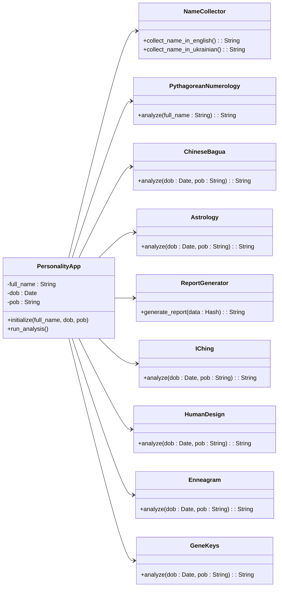

```mermaid
classDiagram
direction LR
    class PersonalityApp {
        +initialize(full_name, dob, pob)
        +run_analysis()
        -full_name : String
        -dob : Date
        -pob : String
    }

    class NameCollector {
        +collect_name_in_english() : String
        +collect_name_in_ukrainian() : String
    }

    class PythagoreanNumerology {
        +analyze(full_name : String) : String
    }

    class ChineseBagua {
        +analyze(dob : Date, pob : String) : String
    }
    class IChing {
        +analyze(dob : Date, pob : String) : String
    }

    class Astrology {
        +analyze(dob : Date, pob : String) : String
    }

    class HumanDesign {
        +analyze(dob : Date, pob : String) : String
    }

    class Enneagram {
        +analyze(dob : Date, pob : String) : String
    }

    class GeneKeys {
        +analyze(dob : Date, pob : String) : String
    }


    class ReportGenerator {
        +generate_report(data : Hash) : String
    }

    PersonalityApp --> NameCollector
    PersonalityApp --> PythagoreanNumerology
    PersonalityApp --> ChineseBagua
    PersonalityApp --> Astrology
    PersonalityApp --> ReportGenerator
    PersonalityApp --> IChing
    PersonalityApp --> HumanDesign
    PersonalityApp --> Enneagram
    PersonalityApp --> GeneKeys
```